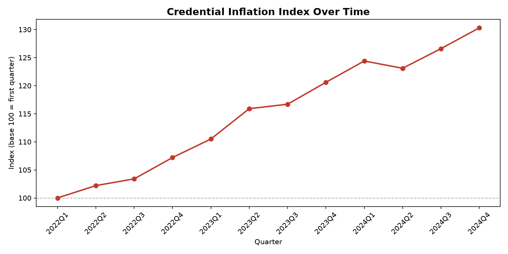
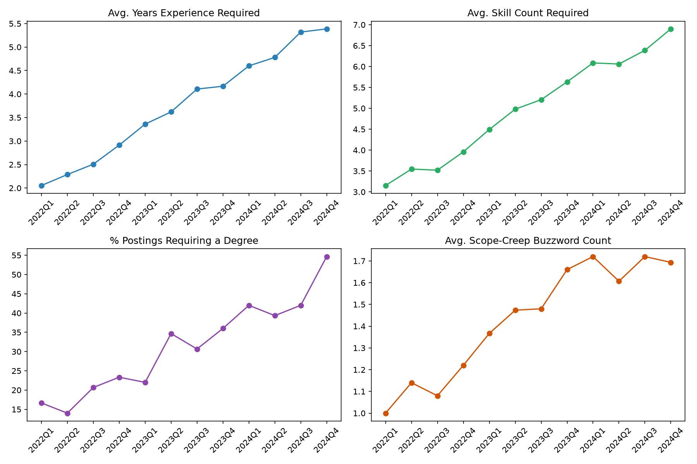

# Job Posting Skill-Inflation Index

Measures whether the bar for a given job role (default: "Data Analyst") has
risen over time — more years of experience demanded, more required skills,
stricter degree requirements, more scope-creep buzzwords — and rolls it into
a single **Credential Inflation Index**.

## Headline finding (on synthetic demo data)

The index moved from **100.0 in 2022 Q1 to 131.4 in 2024 Q4** — a synthetic
demonstration of what a ~31% credential inflation trend would look like.
Swap in real data to get your own answer.




## Pipeline

```
data/generate_sample_data.py   -> synthetic postings (for testing the pipeline)
scraper/wayback_scraper.py     -> REAL archived postings via Wayback Machine
analysis/extract_features.py   -> NLP extraction: years exp, skills, degree, buzzwords
analysis/build_index.py        -> aggregates by quarter, builds the composite index
analysis/visualize.py          -> headline charts
```

## Quickstart (with synthetic data)

```bash
pip install pandas matplotlib beautifulsoup4 requests --break-system-packages

cd data
python3 generate_sample_data.py --role "Data Analyst" --n_per_quarter 150 \
    --start 2022Q1 --end 2024Q4 --out ../output/sample_postings.csv

cd ../analysis
python3 extract_features.py --in ../output/sample_postings.csv --out ../output/features.csv
python3 build_index.py --in ../output/features.csv --out ../output/index_by_quarter.csv
python3 visualize.py --in ../output/index_by_quarter.csv --outdir ../output
```

## Using real data instead

LinkedIn, Indeed, and Glassdoor all prohibit scraping in their Terms of
Service. Safer real-data routes, in order of preference:

1. **Wayback Machine** (`scraper/wayback_scraper.py`) — pulls archived
   snapshots of a specific URL (e.g. a company careers page) over time.
   Works best on company career pages, which are archived more permissively
   than major job boards.
2. **Licensed/public datasets** — Kaggle job posting archives, Lightcast
   (Burning Glass), or government labor statistics APIs.
3. **Official APIs** — Indeed Publisher API, LinkedIn Talent Solutions API
   (both require approval and have usage limits).

Whatever the source, feed a CSV with at minimum a `description` column and
a `quarter` column (e.g. `2023Q2`) into `extract_features.py` and the rest
of the pipeline works unchanged.

## Customizing for other roles

Edit `SKILL_TAXONOMY` in `analysis/extract_features.py` to match the tools
relevant to your target role (e.g. swap in `Figma`, `React`, `Kubernetes`
for a different job family).

## Known limitations

- **Template/length confound**: longer, more detailed postings will show
  higher skill counts even if actual bars haven't risen — worth flagging
  explicitly if you publish results.
- **Years-of-experience regex** captures the first number pattern matching
  "N years" — postings with multiple experience mentions (e.g. for
  different sub-skills) may need more careful parsing.
- **Wayback coverage** is uneven; smaller/less-visited career pages may
  have sparse historical snapshots.

## Suggested extensions

- Break the index out by company size (startup / mid-size / enterprise)
- Compare 2-3 role titles side by side (Data Analyst vs. Data Scientist vs. BI Analyst)
- Correlate the index against macro hiring indicators (layoffs.fyi data, BLS job openings)
- Wrap in a small Streamlit app: type a role, see its inflation trend
